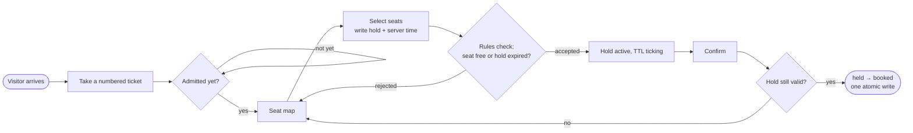

<div align="center">

# 🎟️ SeatLock

### Flash-sale seat booking that stays correct when thousands of people click at once.

A virtual waiting room meters who can reach the seat map, and seats are held with
time-limited, server-enforced locks, so **a seat can never be sold twice.**

<br />


[How it works](#-how-it-works) ·
[Run it locally](#-run-it-locally) ·
[Tests](#-tests) ·
[Docs](#-documentation)

</div>

---

## ✨ Highlights

- **🚪 Virtual waiting room.** The seat map never sees the full herd.
- **⏱️ Time-limited holds.** Server-stamped TTLs that expire on their own.
- **⚛️ Atomic booking.** All your seats flip to booked in a single write, or none do.
- **🛡️ Zero custom backend.** Every guarantee is enforced by database security rules.

---

## 🧠 How it works



### 1. Waiting room
Each visitor takes a **numbered ticket**. Tickets are admitted **a few at a time on a
server-time schedule**, so the seat map never sees the full herd.

### 2. Optimistic seat holds with a TTL
Selecting seats writes a hold stamped with **server time**. The rules reject the write if
someone else already holds the seat. Holds expire **lazily**: an expired hold simply
counts as free, so no cleanup job is needed.

### 3. Atomic booking
Confirming flips `held → booked` for **all your seats in one write**, and only while
your hold is still valid.

> [!NOTE]
> There is no custom server. Correctness lives in the database security rules, which
> every client write must pass.

---

## 🚀 Run it locally

**Requirements:** Node **20.19+** and Java **21+** (needed by the Firebase emulators).

```bash
npm install
cp .env.example .env.local
```

Then, in two terminals:

```bash
# Terminal 1: start the Firebase emulators
npm run emulators

# Terminal 2: seed the demo event
npm run seed
```

Finally, start the app:

```bash
npm run dev
```

Open **<http://localhost:5173/event/demo>** in **two browser windows** and try to grab
the same seat from both.

---

## 🧪 Tests

| Command | What it covers |
| --- | --- |
| `npm test` | Pure logic |
| `npm run test:rules` | Security rules, run against the emulator |
| `npm run loadtest` | Thundering-herd test *(emulators must be running)* |

---

## 📚 Documentation

| Doc | Contents |
| --- | --- |
| [`docs/ARCHITECTURE.md`](docs/ARCHITECTURE.md) | The invariants the system guarantees and how the rules enforce them |
| [`docs/SCALING.md`](docs/SCALING.md) | The path to Redis, a message queue, and sharded Postgres |

---

<div align="center">

**Built with React, Vite, and Firebase Realtime Database.**

</div>